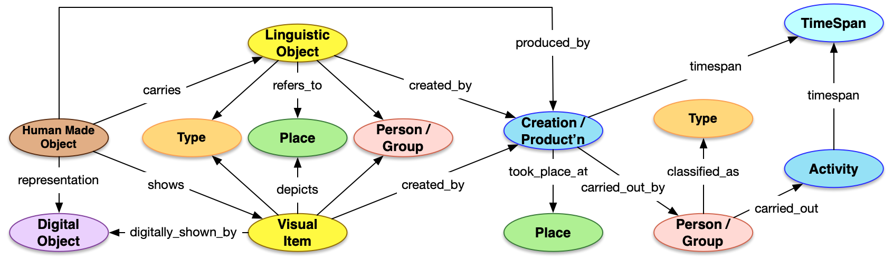

# Content and carriers

In Linked Art, record-level entities are divided into two categories:

-   Conceptual entities, which represent the intellectual content of a resource:

    -   `Set`

    -   `LinguisticObject`

    -   `VisualItem`

-   Carrier entities, which carry that content in a particular form:

    -   `DigitalObject`

    -   `HumanMadeObject`


**Note:** **Supertype format classifications are always assigned to the corresponding `DigitalObject` or `HumanMadeObject` resource.**

**Note:** Previously, supertypes under the `Datasets` and `Software and Electronic Media` content types were mapped to a single `DigitalObject` resource. This mapping has been changed in `v2.0`. Now, these content types should be assigned a base class of `LinguisticObject`, with the same content/carrier split as all other resources.

In MARC-based systems, this content/carrier model corresponds roughly to the distinction between bibliographic records and holdings plus item records.

For each record-level resource with a base class of `LinguisticObject` or `VisualItem` \(the *content* level\), one or more resources with a base class of `HumanMadeObject` or `DigitalObject` \(the *carrier* level\) must be generated. For each record-level resource with a base class of `Set` \(the *content* level\), a nested `members_exemplified_by → HumanMadeObject` resource must be generated.

**Note:** `DigitalObject` carriers should be generated when the MFHD `852b` has a value of `yulint` or `yulintx`.

These `HumanMadeObject` or `DigitalObject` resources must be related to the `Set`, `LinguisticObject`, or `VisualItem` resource that they exemplify or instantiate and where any subjects, etc., are assigned.

The following diagram provides a high-level overview of the Linked Art model.



## Processing steps and output

1.  Process each holdings record as a carrier-level record.

2.  For each carrier-level record, determine the supertype of the resource and generate a JSON-LD document with a `type` value of either `HumanMadeObject` or `DigitalObject`, as appropriate.

    **Note:** Each `HumanMadeObject` or `DigitalObject` must also have a `Name` classified as its `Primary Name`, derived from the primary name of the content-level resource.

    **Note:** For supertypes with two possible base classes \(such as [Globes](supertypes/globes.md)\), apply the [order of preference](../concepts/record_level_entities.md#) for base classes when generating the content-level resource.

    **Note:** This example is meant to illustrate supertype assignment and does not represent a complete JSON-LD document.

    ```
    {
      "@context": "https://linked.art/ns/v1/linked-art.json",
      "id": "https://lux.collections.yale.edu/data/object/abc",
      "type": "HumanMadeObject",
      "_label": "麗澤論說集錄 : [十卷]",
      "classified_as": [
        {
          "id": "http://vocab.getty.edu/aat/300028051",
          "type": "Type",
          "_label": "Books",
          "classified_as": [
            {
              "id": "http://vocab.getty.edu/aat/300435443",
              "type": "Type",
              "_label": "Type of Object"
            }
          ]
        }
      ],
      "identified_by": [
        {
          "type": "Name",
          "content": "Li ze lun shuo ji lu : [shi juan]",
          "classified_as": [
            {
              "id": "http://vocab.getty.edu/aat/300404670",
              "type": "Type",
              "_label": "Primary Name"
            }
          ]
        },
        {
          "type": "Name",
          "content": "麗澤論說集錄 : [十卷]",
          "classified_as": [
            {
              "id": "http://vocab.getty.edu/aat/300404670",
              "type": "Type",
              "_label": "Primary Name"
            }
          ],
          "language": [
            {
              "id": "https://lux.collections.yale.edu/data/concept/70cb6397-2b2f-400c-b887-70fd80969c8b",
              "type": "Language",
              "_label": "und"
            }
          ]
        }
      ]
    }
    ```

3.  For each MARC bibliographic \(content-level\) record, generate a JSON-LD document with a `type` value corresponding to the base class of the supertype.

4.  Add another `classified_as` object to mark the content-level record as an "Information Artifact" \(IRI `http://vocab.getty.edu/aat/300230425`\).

    ```
    {
      "@context": "https://linked.art/ns/v1/linked-art.json",
      "id": "https://lux.collections.yale.edu/data/text/416165c2-1108-4acd-b7ab-008f773a2ba3",
      "type": "LinguisticObject",
      "_label": "麗澤論說集錄 : [十卷]",
      "classified_as": [    
        {
          "id": "http://vocab.getty.edu/aat/300230425",
          "type": "Type",
          "_label": "Information Artifact"
        }
      ],
      "identified_by": [
        {
          "type": "Name",
          "content": "Li ze lun shuo ji lu : [shi juan]",
          "classified_as": [
            {
              "id": "http://vocab.getty.edu/aat/300404670",
              "type": "Type",
              "_label": "Primary Name"
            }
          ]
        },
        {
          "type": "Name",
          "content": "麗澤論說集錄 : [十卷]",
          "classified_as": [
            {
              "id": "http://vocab.getty.edu/aat/300404670",
              "type": "Type",
              "_label": "Primary Name"
            }
          ],
          "language": [
            {
              "id": "https://lux.collections.yale.edu/data/concept/70cb6397-2b2f-400c-b887-70fd80969c8b",
              "type": "Language",
              "_label": "und"
            }
          ]
        }
      ]
    }
    ```

5.  For each holdings \(carrier-level\) record attached to a bibliographic record:

    -   If the base class derived from the supertype is `LinguisticObject` or `VisualItem`:
        -   If the MFHD `852b` is `yulint` or `yulintx`, generate a JSON-LD document with a base class of `DigitalObject`.
        -   Else, generate a JSON-LD document with a base class of `HumanMadeObject`.
    -   If the base class derived from the supertype is `Set`, generate an embedded `Set → members_exemplified_by → HumanMadeObject` resource to record carrier-level information.
6.  If the supertype of the resource corresponding to the bibliographic record has a base class of `LinguisticObject` or `VisualItem`, then `HumanMadeObject` carriers must point to the content-level resource using the `carries` property for `LinguisticObject` resources or the `shows` property for `VisualItem` resources. For `DigitalObject` carriers, the corresponding properties are `digitally_carries` and `digitally_shows`.

7.  If the supertype of the resource corresponding to the bibliographic record has a base class of `Set` \(for archival records or kits\), then the `HumanMadeObject` carrier is **not** modeled as a separate resource, but rather embedded within the `Set` resource using the property `members_exemplified_by`.


**Note:** These examples are meant to illustrate the content/carrier distinction and do not necessarily represent complete JSON-LD documents.

1.  `Set → members_exemplified_by → HumanMadeObject` \[`3779671`\]

    ```
    {
      "id": "https://lux.collections.yale.edu/data/set/00046754-f28f-4b56-a611-056341335226",
      "type": "Set",
      "_label": "شجون المسجون وفتون المفتون / 1863",
      "members_exemplified_by": [
        {
          "type": "HumanMadeObject",
          "_label": "شجون المسجون وفتون المفتون / 1863",
          "identified_by": [
            {
              "type": "Identifier",
              "content": "Arabic MSS 480",
              "classified_as": [
                {
                  "id": "http://vocab.getty.edu/aat/300311706",
                  "type": "Type",
                  "_label": "Call Number"
                }
              ]
            }
          ],
          "referred_to_by": [
            {
              "type": "LinguisticObject",
              "content": "In the Library",
              "classified_as": [
                {
                  "id": "http://vocab.getty.edu/aat/300133046",
                  "type": "Type",
                  "_label": "Access Statement",
                  "classified_as": [
                    {
                      "id": "http://vocab.getty.edu/aat/300418049",
                      "type": "Type",
                      "_label": "Brief Text"
                    }
                  ]
                }
              ]
            },
            {
              "type": "LinguisticObject",
              "content": "Purchased from Oskar Rescher in August 1959 on plain fund.",
              "classified_as": [
                {
                  "id": "http://vocab.getty.edu/aat/300435438",
                  "type": "Type",
                  "_label": "Provenance Statement",
                  "classified_as": [
                    {
                      "id": "http://vocab.getty.edu/aat/300418049",
                      "type": "Type",
                      "_label": "Brief Text"
                    }
                  ]
                }
              ]
            },
            {
              "type": "LinguisticObject",
              "content": "leaves 119 verso-176 ; 24.5 x 18 cm",
              "classified_as": [
                {
                  "id": "http://vocab.getty.edu/aat/300435452",
                  "type": "Type",
                  "_label": "Physical Statement",
                  "classified_as": [
                    {
                      "id": "http://vocab.getty.edu/aat/300418049",
                      "type": "Type",
                      "_label": "Brief Text"
                    }
                  ]
                }
              ],
              "identified_by": [
                {
                  "type": "Name",
                  "content": "Physical Description",
                  "classified_as": [
                    {
                      "id": "http://vocab.getty.edu/aat/300404669",
                      "type": "Type",
                      "_label": "Display Title"
                    }
                  ]
                }
              ]
            },
            {
              "type": "LinguisticObject",
              "content": "Purchased from Oskar Rescher in August 1959 on plain fund.",
              "classified_as": [
                {
                  "id": "http://vocab.getty.edu/aat/300435438",
                  "type": "Type",
                  "_label": "Provenance Statement"
                }
              ],
              "identified_by": [
                {
                  "type": "Name",
                  "content": "Ownership and Custodial History",
                  "classified_as": [
                    {
                      "id": "http://vocab.getty.edu/aat/300404669",
                      "type": "Type",
                      "_label": "Display Title"
                    }
                  ]
                }
              ]
            }
          ],
          "subject_of": [
            {
              "type": "LinguisticObject",
              "_label": "Text of Repository Page",
              "digitally_carried_by": [
                {
                  "type": "DigitalObject",
                  "_label": "Repository Page",
                  "access_point": [
                    {
                      "id": "https://search.library.yale.edu/catalog/3779671",
                      "type": "DigitalObject"
                    }
                  ]
                }
              ]
            }
          ],
          "member_of": [
            {
              "id": "https://lux.collections.yale.edu/data/set/xyz",
              "type": "Set",
              "_label": "Beinecke Library"
            }
          ],
          "carries": [
            {
              "type": "LinguisticObject",
              "language": [
                {
                  "id": "https://lux.collections.yale.edu/data/concept/2b8c1ef3-fb14-4306-9d7c-d5b198acc3f8",
                  "type": "Language",
                  "_label": "Arabic"
                }
              ]
            }
          ]
        }
      ]
    }
    ```

2.  `HumanMadeObject → carries → LinguisticObject` \[`7778409`\]

    ```
    {
      "@context": "https://linked.art/ns/v1/linked-art.json",
      "id": "https://lux.collections.yale.edu/data/object/8e0bdbff-ebb1-4f9b-b98b-e97d64a01ff9",
      "type": "HumanMadeObject",
      "_label": "麗澤論說集錄 : [十卷] [1-5]",
      "classified_as": [
        {
          "id": "http://vocab.getty.edu/aat/300028051",
          "type": "Type",
          "_label": "Books",
          "classified_as": [
            {
              "id": "http://vocab.getty.edu/aat/300435443",
              "type": "Type",
              "_label": "Type of Object"
            }
          ]
        }
      ],  
      "identified_by": [
        {
          "type": "Identifier",
          "content": "ils:yul:mfhd:8240722",
          "attributed_by": [
            {
              "type": "AttributeAssignment",
              "carried_out_by": [
                {
                  "id": "https://lux.collections.yale.edu/data/group/yale-university-library",
                  "type": "Group",
                  "_label": "Yale University Library"
                }
              ]
            }
          ],
          "classified_as": [
            {
              "id": "http://vocab.getty.edu/aat/300435704",
              "type": "Type",
              "_label": "System-Assigned Number"
            }
          ]
        },
        {
          "type": "Identifier",
          "content": "BL1840.L84 2003",
          "classified_as": [
            {
              "id": "http://vocab.getty.edu/aat/300311706",
              "type": "Type",
              "_label": "Call Number"
            }
          ]
        },
        {
          "type": "Name",
          "content": "Li ze lun shuo ji lu : [shi juan]",
          "classified_as": [
            {
              "id": "http://vocab.getty.edu/aat/300404670",
              "type": "Type",
              "_label": "Primary Name"
            }
          ]
        },
        {
          "type": "Name",
          "content": "麗澤論說集錄 : [十卷]",
          "classified_as": [
            {
              "id": "http://vocab.getty.edu/aat/300404670",
              "type": "Type",
              "_label": "Primary Name"
            }
          ],
          "language": [
            {
              "id": "https://lux.collections.yale.edu/data/concept/70cb6397-2b2f-400c-b887-70fd80969c8b",
              "type": "Language",
              "_label": "und"
            }
          ]
        }
      ],
      "referred_to_by": [
        {
          "type": "LinguisticObject",
          "content": "In the Library",
          "classified_as": [
            {
              "id": "http://vocab.getty.edu/aat/300133046",
              "type": "Type",
              "_label": "Access Statement",
              "classified_as": [
                {
                  "id": "http://vocab.getty.edu/aat/300418049",
                  "type": "Type",
                  "_label": "Brief Text"
                }
              ]
            }
          ]
        },
        {
          "type": "LinguisticObject",
          "content": "5 v. ; 33 cm",
          "classified_as": [
            {
              "id": "http://vocab.getty.edu/aat/300435452",
              "type": "Type",
              "_label": "Physical Statement",
              "classified_as": [
                {
                  "id": "http://vocab.getty.edu/aat/300418049",
                  "type": "Type",
                  "_label": "Brief Text"
                }
              ]
            }
          ],
          "identified_by": [
            {
              "type": "Name",
              "content": "Physical Description",
              "classified_as": [
                {
                  "id": "http://vocab.getty.edu/aat/300404669",
                  "type": "Type",
                  "_label": "Display Title"
                }
              ]
            }
          ]
        }
      ],
      "subject_of": [
        {
          "type": "LinguisticObject",
          "_label": "Text of Repository Page",
          "digitally_carried_by": [
            {
              "type": "DigitalObject",
              "_label": "Repository Page",
              "access_point": [
                {
                  "id": "https://search.library.yale.edu/catalog/7778409",
                  "type": "DigitalObject"
                }
              ]
            }
          ]
        }
      ],
      "member_of": [
        {
          "id": "https://lux.collections.yale.edu/data/set/collection1",
          "type": "Set",
          "_label": "Yale University Library"
        }
      ],
      "carries": [
        {
          "id": "https://lux.collections.yale.edu/data/text/416165c2-1108-4acd-b7ab-008f773a2ba3",
          "type": "LinguisticObject",
          "_label": "麗澤論說集錄 : [十卷]"
        }
      ]
    }
    ```

3.  `HumanMadeObject → shows → VisualItem` \[`9777342`\]

    ```
    {
      "@context": "https://linked.art/ns/v1/linked-art.json",
      "id": "https://lux.collections.yale.edu/data/object/000564c6-1615-47e6-b379-192e16a3e14a",
      "type": "HumanMadeObject",
      "_label": "Lessons for shaving!!! [graphic]",
      "classified_as": [
        {
          "id": "http://vocab.getty.edu/aat/300041273",
          "type": "Type",
          "_label": "Prints",
          "classified_as": [
            {
              "id": "http://vocab.getty.edu/aat/300435443",
              "type": "Type",
              "_label": "Type of Object"
            }
          ]
        }
      ], 
      "identified_by": [
        {
          "type": "Identifier",
          "content": "ils:yul:mfhd:10086516",
          "attributed_by": [
            {
              "type": "AttributeAssignment",
              "carried_out_by": [
                {
                  "id": "https://lux.collections.yale.edu/data/group/yale-university-library",
                  "type": "Group",
                  "_label": "Yale University Library"
                }
              ]
            }
          ],
          "classified_as": [
            {
              "id": "http://vocab.getty.edu/aat/300435704",
              "type": "Type",
              "_label": "System-Assigned Number"
            }
          ]
        },
        {
          "type": "Identifier",
          "content": "796.04.16.02++",
          "classified_as": [
            {
              "id": "http://vocab.getty.edu/aat/300311706",
              "type": "Type",
              "_label": "Call Number"
            }
          ]
        },
        {
          "type": "Name",
          "content": "Lessons for shaving!!! [graphic]",
          "classified_as": [
            {
              "id": "http://vocab.getty.edu/aat/300404670",
              "type": "Type",
              "_label": "Primary Name"
            }
          ]
        }
      ],
      "referred_to_by": [
        {
          "type": "LinguisticObject",
          "content": "In the Library",
          "classified_as": [
            {
              "id": "http://vocab.getty.edu/aat/300133046",
              "type": "Type",
              "_label": "Access Statement",
              "classified_as": [
                {
                  "id": "http://vocab.getty.edu/aat/300418049",
                  "type": "Type",
                  "_label": "Brief Text"
                }
              ]
            }
          ]
        },
        {
          "type": "LinguisticObject",
          "content": "1 print : etching on wove paper, hand-colored ; plate mark 34.8 x 48 cm, on sheet 38 x 50 cm",
          "classified_as": [
            {
              "id": "http://vocab.getty.edu/aat/300435452",
              "type": "Type",
              "_label": "Physical Statement",
              "classified_as": [
                {
                  "id": "http://vocab.getty.edu/aat/300418049",
                  "type": "Type",
                  "_label": "Brief Text"
                }
              ]
            }
          ],
          "identified_by": [
            {
              "type": "Name",
              "content": "Physical Description",
              "classified_as": [
                {
                  "id": "http://vocab.getty.edu/aat/300404669",
                  "type": "Type",[
                  "_label": "Display Title"
                }
              ]
            }
          ]
        }
      ],
      "subject_of": [
        {
          "type": "LinguisticObject",
          "_label": "Text of Repository Page",
          "digitally_carried_by": [
            {
              "type": "DigitalObject",
              "_label": "Repository Page",
              "access_point": [
                {
                  "id": "https://search.library.yale.edu/catalog/9777342",
                  "type": "DigitalObject"
                }
              ]
            }
          ]
        }
      ],
      "member_of": [
        {
          "id": "https://lux.collections.yale.edu/data/set/collection-lwl",
          "type": "Set",
          "_label": "Lewis Walpole Library"
        }
      ],
      "produced_by": {
        "type": "Production",
        "part": [
          {
            "type": "Production",
            "carried_out_by": [
              {
                "id": "https://lux.collections.yale.edu/data/person/6a4346f3-b238-47d4-a6d0-980c21c0a307",
                "type": "Person",
                "_label": "Woodward, G. M. (George Moutard), approximately 1760-1809"
              }
            ]
          }
        ]
      },
      "shows": [
        {
          "id": "https://lux.collections.yale.edu/data/visual/fd3d836b-1cd1-47d9-a38e-002ce325601b",
          "type": "VisualItem",
          "_label": "Lessons for shaving!!! [graphic]"
        }
      ]
    }
    ```

4.  `DigitalObject → digitally_carries → LinguisticObject` \[`6546882`\]

    ```
    {
      "@context": "https://linked.art/ns/v1/linked-art.json",
      "id": "https://lux.collections.yale.edu/data/object/e161c7e7-7a78-4976-8774-0de867c3222d",
      "type": "DigitalObject",
      "_label": "ZYX and his fairy, or, The soul in search of peace [electronic resource]",
      "classified_as": [
        {
          "id": "http://vocab.getty.edu/aat/300028051",
          "type": "Type",
          "_label": "Books",
          "classified_as": [
            {
              "id": "http://vocab.getty.edu/aat/300435443",
              "type": "Type",
              "_label": "Type of Object"
            }
          ]
        }
      ],
      "identified_by": [
        {
          "type": "Name",
          "content": "ZYX and his fairy, or, The soul in search of peace [electronic resource]",
          "classified_as": [
            {
              "id": "http://vocab.getty.edu/aat/300404670",
              "type": "Type",
              "_label": "Primary Name"
            }
          ]
        }
      ],
      "digitally_carries": [
        {
          "id": "https://lux.collections.yale.edu/data/text/7210e343-ce9d-4853-8454-a7c4e88644db",
          "type": "LinguisticObject",
          "_label": "ZYX and his fairy, or, The soul in search of peace [electronic resource]"
        }
      ]
    }
    ```

5.  `DigitalObject → digitally_shows → VisualItem` \[`12237283`\]

    ```
    {
      "@context": "https://linked.art/ns/v1/linked-art.json",
      "id": "https://lux.collections.yale.edu/data/object/ed9af261-e373-40fa-8248-48afb62eb3c2",
      "type": "DigitalObject",
      "_label": "Sarah Malcolm [graphic] : executed in Fleet Street, March the 7th 1733 for robbing [the] chambers of Mrs. Lydia Duncomb in [the] Temple, & murdering her, Eliz. Harrison, & Ann Price",
      "classified_as": [
        {
          "id": "http://vocab.getty.edu/aat/300041273",
          "type": "Type",
          "_label": "Prints",
          "classified_as": [
            {
              "id": "http://vocab.getty.edu/aat/300435443",
              "type": "Type",
              "_label": "Type of Object"
            }
          ]
        }
      ],
      "identified_by": [
        {
          "type": "Name",
          "content": "Sarah Malcolm [graphic] : executed in Fleet Street, March the 7th 1733 for robbing [the] chambers of Mrs. Lydia Duncomb in [the] Temple, & murdering her, Eliz. Harrison, & Ann Price",
          "classified_as": [
            {
              "id": "http://vocab.getty.edu/aat/300404670",
              "type": "Type",
              "_label": "Primary Name"
            }
          ]
        }
      ],
      "digitally_shows": [
        {
          "id": "https://lux.collections.yale.edu/data/visual/8cf565ab-f2ad-4af2-9840-c18f36d6fe08",
          "type": "VisualItem",
          "_label": "Sarah Malcolm [graphic] : executed in Fleet Street, March the 7th 1733 for robbing [the] chambers of Mrs. Lydia Duncomb in [the] Temple, & murdering her, Eliz. Harrison, & Ann Price"
        }
      ]
    }
    ```


**Parent topic:**[Record-level entities](../concepts/record_level_entities.md)

